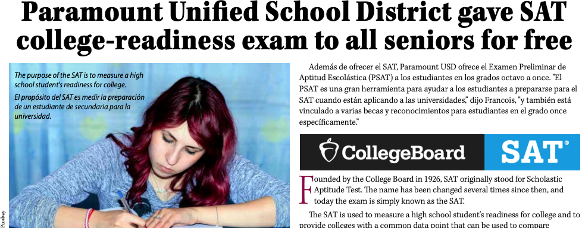
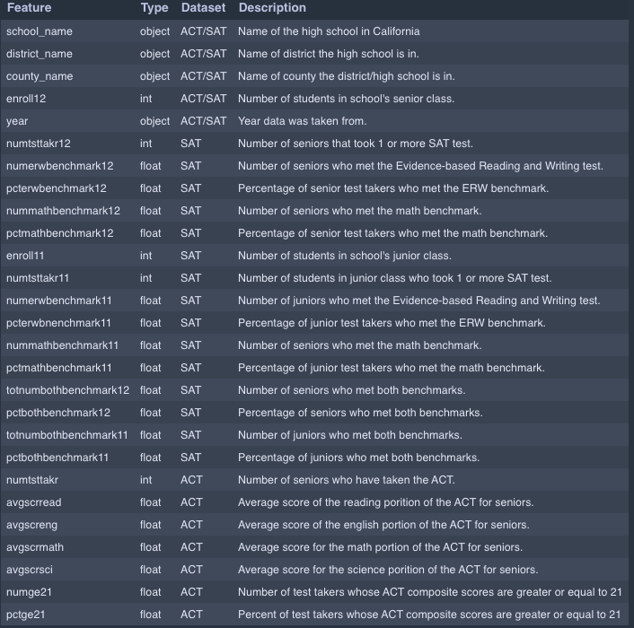
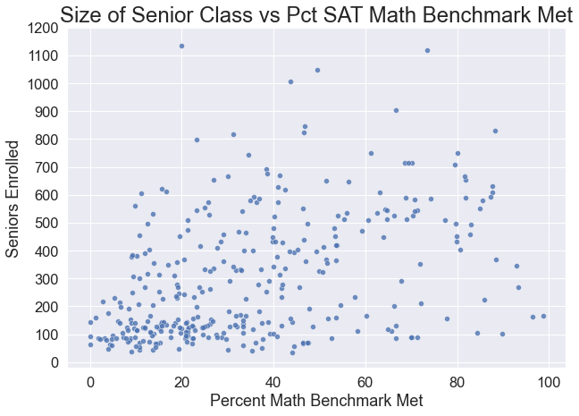

# Best School district in Los Angeles County

Los Angeles County is a heavily populated county in California with 10,004,300 people living in it. Our schools are heavily populated along with schools that aren't. Which ones do we choose? This project will look into SAT and ACT performance, ranking top five and bottom five, for parents of college-seeking students.

## Which ones do we choose?

## Problem Statement:

Los Angeles County is a heavily populated county in California with 10,004,300 people living in it. Our schools are heavily populated along with schools that aren't. Which ones do we choose? This project will look into SAT and ACT performance, ranking top five and bottom five, for parents of college-seeking students.

## Background:

⋅⋅* Broken down by test components, the SAT has a reading test that takes 65 minutes, a 35-minute writing and language test and an 80-minute math section. The ACT is comprised of a 35-minute reading test, 45-minute English test, 60-minute math section and 35-minute science test.(usnews.com)

⋅⋅* Colleges use SAT and ACT as a metric to measure college readiness and to predict future academic success.
 
⋅⋅* According to schooltree.org, there are 2548 high schools and according to wikipedia there are 78 school districts in Los Angeles County.

#### Scores:

1. SAT
⋅⋅* Evidence-Based Reading & Writing: 480 
⋅⋅* Math: 530
2. ACT
⋅⋅* English: 18
⋅⋅* Math: 22
⋅⋅* Reading: 22
⋅⋅* Science: 23

## DATA

[I'm an inline-style link with title](https://git.generalassemb.ly/sampeou/project_1/blob/master/data/sat_2019_ca.csv "2018-2019 SAT DATA")
[I'm an inline-style link with title](https://git.generalassemb.ly/sampeou/project_1/blob/master/data/act_2019_ca.csv "2018-2019 ACT DATA")
[I'm an inline-style link with title](https://git.generalassemb.ly/sampeou/project_1/blob/master/data/edited_act.csv "CLEANED 018-2019 ACT DATA")
[I'm an inline-style link with title](https://git.generalassemb.ly/sampeou/project_1/blob/master/data/edited_sat.csv "CLEANED 018-2019 SAT DATA")

## Column Dictionary

## Outside Research:

https://www.cde.ca.gov/ for SAT and ACT background information. 
https://www.PPIC.org for research paper on future success based on math courses. 
https://www.Wikipedia.com -- Number of school districts in Los Angeles County. 
http://www.paramount.k12.ca.us/ for information on someone skewed information.

## Data Analysis:

Using Pandas, Seaborn, Python, and various information off of stackoverflow.com, I cleaned the data by dropping all the nulls right off the bat. Because a lot of schools either didn't have information on their students exams or didn't have any participation at all. One of the row of code carried the totals of all columns, and that needed to be dropped in order to not skew the data. Both datas had similar cleaning issues, so the changes were the same for both. I used seaborn for plots to illustrate the correlations between sizes of senior class and results from the test.

## Conclusion and Recommendations:

When you're looking into different parts of Los Angeles, CA with a family it is crucial to find a neighborhood that is in a good school district. Less doesn't always mean more, schools within a certain range of students in their senior classes perform better in preparing students for college. The top school districts in Los Angeles,CA based on just rankings doesn't always apply to every Californian because you can't just send your perspective student to any school at any address. You need to have your home address in that district. Finding the right schools with the right students in their senior class could still better the chances of your student's success.